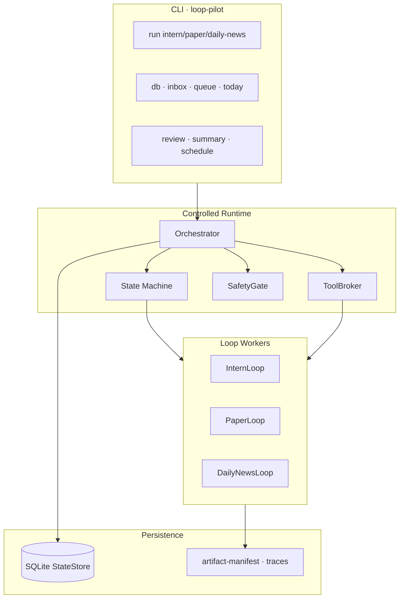

# LoopPilot

> Loop Engineering Ecosystem 的 **Runtime Layer** — 受控 AI 工作闭环、可审计产物、默认 fail-closed 安全。

<p align="center">
<svg xmlns="http://www.w3.org/2000/svg" viewBox="0 0 720 28" role="img" aria-label="Project badges">
  <defs>
    <linearGradient id="g-ready" x1="0%" y1="0%" x2="100%" y2="0%">
      <stop offset="0%" stop-color="#16a34a"/>
      <stop offset="100%" stop-color="#22c55e"/>
    </linearGradient>
    <linearGradient id="g-tests" x1="0%" y1="0%" x2="100%" y2="0%">
      <stop offset="0%" stop-color="#2563eb"/>
      <stop offset="100%" stop-color="#3b82f6"/>
    </linearGradient>
    <linearGradient id="g-py" x1="0%" y1="0%" x2="100%" y2="0%">
      <stop offset="0%" stop-color="#7c3aed"/>
      <stop offset="100%" stop-color="#8b5cf6"/>
    </linearGradient>
    <linearGradient id="g-ver" x1="0%" y1="0%" x2="100%" y2="0%">
      <stop offset="0%" stop-color="#0d9488"/>
      <stop offset="100%" stop-color="#14b8a6"/>
    </linearGradient>
    <linearGradient id="g-lic" x1="0%" y1="0%" x2="100%" y2="0%">
      <stop offset="0%" stop-color="#475569"/>
      <stop offset="100%" stop-color="#64748b"/>
    </linearGradient>
  </defs>
  <rect x="0" y="0" width="118" height="28" rx="6" fill="url(#g-ready)"/>
  <text x="59" y="18" text-anchor="middle" fill="#fff" font-family="system-ui,sans-serif" font-size="11" font-weight="600">0.4 READY</text>
  <rect x="124" y="0" width="108" height="28" rx="6" fill="url(#g-tests)"/>
  <text x="178" y="18" text-anchor="middle" fill="#fff" font-family="system-ui,sans-serif" font-size="11" font-weight="600">254 tests</text>
  <rect x="238" y="0" width="108" height="28" rx="6" fill="url(#g-py)"/>
  <text x="292" y="18" text-anchor="middle" fill="#fff" font-family="system-ui,sans-serif" font-size="11" font-weight="600">Python ≥3.11</text>
  <rect x="352" y="0" width="118" height="28" rx="6" fill="url(#g-ver)"/>
  <text x="411" y="18" text-anchor="middle" fill="#fff" font-family="system-ui,sans-serif" font-size="11" font-weight="600">v0.4.0b1</text>
  <rect x="476" y="0" width="130" height="28" rx="6" fill="url(#g-lic)"/>
  <text x="541" y="18" text-anchor="middle" fill="#fff" font-family="system-ui,sans-serif" font-size="11" font-weight="600">Apache-2.0</text>
</svg>
</p>

**LoopPilot** 是个人长期使用的 AI 工作闭环运行时：在显式安全边界内运行开发、研究与信息 Loop，产出可审计 artifacts，并在 patch review 等关键节点 **强制人工门禁**。

English interface spec: [docs/en-core.md](docs/en-core.md)

---

## 价值主张

| 层 | 项目 | 职责 |
|----|------|------|
| **Runtime** | **LoopPilot**（本仓库） | 运行、编排、记录、恢复、审阅 |
| **Evaluation** | [agentic-rubric-runner](https://github.com/bosprimigenious/agentic-rubric-runner) | 评分、审计、benchmark、发布门禁 |

LoopPilot 负责 **「跑」**；agentic-rubric-runner 负责 **「判」**。无人值守必须经过 evaluation gate，而不是让模型自己宣布成功。

---

## 版本里程碑

<p align="center">
<svg xmlns="http://www.w3.org/2000/svg" viewBox="0 0 820 100" role="img" aria-label="Version milestone 0.3 to 0.5">
  <defs>
    <marker id="arrow" markerWidth="8" markerHeight="8" refX="6" refY="3" orient="auto">
      <path d="M0,0 L6,3 L0,6 Z" fill="#94a3b8"/>
    </marker>
  </defs>
  <!-- track -->
  <line x1="80" y1="50" x2="740" y2="50" stroke="#e2e8f0" stroke-width="6" stroke-linecap="round"/>
  <line x1="80" y1="50" x2="420" y2="50" stroke="#22c55e" stroke-width="6" stroke-linecap="round"/>
  <line x1="420" y1="50" x2="580" y2="50" stroke="#3b82f6" stroke-width="6" stroke-linecap="round"/>
  <!-- 0.3 -->
  <circle cx="120" cy="50" r="22" fill="#22c55e" stroke="#fff" stroke-width="3"/>
  <text x="120" y="55" text-anchor="middle" fill="#fff" font-family="system-ui,sans-serif" font-size="11" font-weight="700">0.3</text>
  <text x="120" y="88" text-anchor="middle" fill="#166534" font-family="system-ui,sans-serif" font-size="12" font-weight="600">Mini MVP</text>
  <text x="120" y="14" text-anchor="middle" fill="#64748b" font-family="system-ui,sans-serif" font-size="10">ToolBroker · Adapter gate</text>
  <!-- 0.4 -->
  <circle cx="420" cy="50" r="26" fill="#3b82f6" stroke="#fff" stroke-width="3"/>
  <text x="420" y="55" text-anchor="middle" fill="#fff" font-family="system-ui,sans-serif" font-size="11" font-weight="700">0.4</text>
  <text x="420" y="88" text-anchor="middle" fill="#1d4ed8" font-family="system-ui,sans-serif" font-size="12" font-weight="700">Full · READY</text>
  <text x="420" y="14" text-anchor="middle" fill="#64748b" font-family="system-ui,sans-serif" font-size="10">SQLite · Inbox · Review · Summary</text>
  <!-- 0.5 prep -->
  <circle cx="680" cy="50" r="22" fill="#f59e0b" stroke="#fff" stroke-width="3" stroke-dasharray="4 2"/>
  <text x="680" y="55" text-anchor="middle" fill="#fff" font-family="system-ui,sans-serif" font-size="11" font-weight="700">0.5</text>
  <text x="680" y="88" text-anchor="middle" fill="#b45309" font-family="system-ui,sans-serif" font-size="12" font-weight="600">Safe Autonomy</text>
  <text x="680" y="14" text-anchor="middle" fill="#64748b" font-family="system-ui,sans-serif" font-size="10">0.5-prep · SafetyGate</text>
  <!-- arrows -->
  <line x1="148" y1="50" x2="388" y2="50" stroke="#94a3b8" stroke-width="2" marker-end="url(#arrow)"/>
  <line x1="452" y1="50" x2="652" y2="50" stroke="#94a3b8" stroke-width="2" marker-end="url(#arrow)"/>
  <!-- PR#8 label -->
  <rect x="300" y="28" width="88" height="18" rx="4" fill="#dbeafe" stroke="#93c5fd"/>
  <text x="344" y="40" text-anchor="middle" fill="#1e40af" font-family="system-ui,sans-serif" font-size="9" font-weight="600">PR #8 merged</text>
</svg>
</p>

**当前主线（`main`，2026-06-22）：** `0.4.0b1` Truthful 0.4 baseline 已合入（[PR #8](https://github.com/bosprimigenious/LoopPilot/pull/8)）。聚合验收 `verify_0_4_acceptance.py` **11/11 READY**；`pytest` **254 passed**；`0.5-prep` fail-closed 脚手架已就绪，正式无人值守仍 **BLOCKED**。

---

## Loop 运行状态机

<p align="center">
<svg xmlns="http://www.w3.org/2000/svg" viewBox="0 0 900 200" role="img" aria-label="Loop runtime state machine">
  <defs>
    <marker id="arr2" markerWidth="8" markerHeight="8" refX="6" refY="3" orient="auto">
      <path d="M0,0 L6,3 L0,6 Z" fill="#64748b"/>
    </marker>
    <filter id="shadow" x="-10%" y="-10%" width="120%" height="120%">
      <feDropShadow dx="0" dy="1" stdDeviation="2" flood-opacity="0.15"/>
    </filter>
  </defs>
  <!-- main path -->
  <g filter="url(#shadow)">
    <rect x="10" y="70" width="100" height="44" rx="8" fill="#f1f5f9" stroke="#94a3b8"/>
    <text x="60" y="97" text-anchor="middle" fill="#334155" font-family="monospace" font-size="10" font-weight="600">OBSERVING</text>
    <rect x="140" y="70" width="100" height="44" rx="8" fill="#f1f5f9" stroke="#94a3b8"/>
    <text x="190" y="97" text-anchor="middle" fill="#334155" font-family="monospace" font-size="10" font-weight="600">PLANNING</text>
    <rect x="270" y="70" width="90" height="44" rx="8" fill="#fef3c7" stroke="#f59e0b"/>
    <text x="315" y="97" text-anchor="middle" fill="#92400e" font-family="monospace" font-size="10" font-weight="600">ACTING</text>
    <rect x="390" y="70" width="110" height="44" rx="8" fill="#f1f5f9" stroke="#94a3b8"/>
    <text x="445" y="97" text-anchor="middle" fill="#334155" font-family="monospace" font-size="10" font-weight="600">EVALUATING</text>
    <rect x="530" y="70" width="150" height="44" rx="8" fill="#fce7f3" stroke="#ec4899"/>
    <text x="605" y="97" text-anchor="middle" fill="#9d174d" font-family="monospace" font-size="10" font-weight="600">WAITING_APPROVAL</text>
    <rect x="710" y="70" width="110" height="44" rx="8" fill="#dcfce7" stroke="#22c55e"/>
    <text x="765" y="97" text-anchor="middle" fill="#166534" font-family="monospace" font-size="10" font-weight="600">TERMINATED</text>
  </g>
  <!-- arrows main -->
  <line x1="110" y1="92" x2="136" y2="92" stroke="#64748b" stroke-width="2" marker-end="url(#arr2)"/>
  <line x1="240" y1="92" x2="266" y2="92" stroke="#64748b" stroke-width="2" marker-end="url(#arr2)"/>
  <line x1="360" y1="92" x2="386" y2="92" stroke="#64748b" stroke-width="2" marker-end="url(#arr2)"/>
  <line x1="500" y1="92" x2="526" y2="92" stroke="#64748b" stroke-width="2" marker-end="url(#arr2)"/>
  <line x1="680" y1="92" x2="706" y2="92" stroke="#64748b" stroke-width="2" marker-end="url(#arr2)"/>
  <!-- patch review branch -->
  <path d="M445,114 L445,155 L605,155 L605,118" fill="none" stroke="#ec4899" stroke-width="2" stroke-dasharray="5 3" marker-end="url(#arr2)"/>
  <text x="520" y="172" text-anchor="middle" fill="#9d174d" font-family="system-ui,sans-serif" font-size="10">patch.diff → needs_review</text>
  <!-- gate labels -->
  <rect x="530" y="20" width="150" height="36" rx="6" fill="#fdf2f8" stroke="#f9a8d4"/>
  <text x="605" y="36" text-anchor="middle" fill="#9d174d" font-family="system-ui,sans-serif" font-size="9" font-weight="600">Review Gate</text>
  <text x="605" y="48" text-anchor="middle" fill="#be185d" font-family="system-ui,sans-serif" font-size="8">approve → gate=pass</text>
  <line x1="605" y1="56" x2="605" y2="68" stroke="#ec4899" stroke-width="1.5" marker-end="url(#arr2)"/>
  <!-- outcomes -->
  <text x="765" y="140" text-anchor="middle" fill="#64748b" font-family="system-ui,sans-serif" font-size="9">SUCCEEDED · PARTIAL · BLOCKED</text>
</svg>
</p>

执行阶段不自行宣布成功；`patch.diff` 产出在人工 `approve` 前保持 `needs_review` / `PARTIAL`。详见 [18-state-transition-spec.md](docs/development/18-state-transition-spec.md)。

---

## 三条核心 Loop

| Loop | 做什么 | 状态 |
|------|--------|------|
| **InternLoop** | 开发问题 → 测试 → 修复 → 工程报告 | ✅ fixture / demo / ToolBroker |
| **PaperLoop** | 论文缺口 → 查证 → 修订 → 证据检查 | ✅ fixture / demo |
| **DailyNewsLoop** | 离线信号筛选 → candidate-actions | ✅ demo profile；显式 `import-daily-news` |

```text
DailyNewsLoop ──候选任务──┬──> InternLoop
                          └──> PaperLoop
```

---

## 架构模块



| 模块 | 路径 | 职责 |
|------|------|------|
| Orchestrator | `src/loop_pilot/runtime/` | 状态机、锁、终态产物 |
| ToolBroker | `src/loop_pilot/tools/` | 文件/git/命令/HTTP 策略执行 |
| Review Layer | `src/loop_pilot/review/` | approve/reject/defer/cancel |
| SafetyGate | `src/loop_pilot/safety/` | 0.5-prep fail-closed 门禁 |
| Adapters | `src/loop_pilot/adapters/` | Cursor CLI / OpenAI-compatible（默认 blocked） |

---

## Quick Start

### 安装

```bash
git clone https://github.com/bosprimigenious/LoopPilot.git
cd LoopPilot
python -m pip install -e ".[dev]"
python scripts/bootstrap_local.py   # optional, first time
loop-pilot doctor
```

### WSL 一键部署

```bash
bash scripts/deploy_wsl.sh --repo-dir "$HOME/LoopPilot"
```

脚本会自动完成 clone/pull、`.venv`、依赖安装、`doctor`、`ruff`、`pytest`、0.4/0.5 验收和 dry-run smoke。全新 WSL 环境先安装：

```bash
sudo apt-get update
sudo apt-get install -y git python3 python3-venv python3-pip
```

更多说明见 [docs/zh/16-WSL部署与小程序端.md](docs/zh/16-WSL部署与小程序端.md)。

### 运行 Loop（dry-run）

```bash
# 0.1 fixture 回归
loop-pilot run intern --fixture simple_python_bug --dry-run
loop-pilot run paper --fixture unsupported_claim --dry-run
loop-pilot run daily-news --fixture github_star_snapshots --dry-run

# 0.2 demo workspace
loop-pilot run intern --workspace examples/intern_demo --dry-run
loop-pilot run paper --workspace examples/paper_demo --dry-run
loop-pilot run all --profile demo --dry-run
```

### 0.4 个人日用链

```bash
loop-pilot db status
loop-pilot inbox add "fix login test" --source manual --loop intern
loop-pilot today
loop-pilot review list
loop-pilot summary today
loop-pilot schedule print
```

### 本地 API Bridge（只读）

```bash
loop-pilot api serve --host 127.0.0.1 --port 7860
```

用于小程序端或轻量 dashboard 读取 `/api/health`、`/api/summary/today`、`/api/runs`、`/api/reviews`。当前不提供 approve/reject 写接口。

### 验收门禁（CI / 本地）

```bash
# 组件验收
python scripts/verify_0_3_acceptance.py      # 0.3 ToolBroker + Adapter
python scripts/verify_0_4b_acceptance.py     # 0.4-b Inbox/Queue/Today
python scripts/verify_0_4c_acceptance.py     # 0.4-c Review Layer
python scripts/verify_0_4d_acceptance.py     # 0.4-d Summary/Schedule

# 聚合 Truthful 0.4（唯一可宣告 Full 0.4 READY 的脚本）
python scripts/verify_0_4_acceptance.py

# 0.5-prep fail-closed 脚手架
python scripts/verify_0_5_prep.py

# 基础质量
ruff check .
pytest -q
```

---

## 验收门禁表

| 脚本 | 范围 | PASS 标准 | 当前状态 |
|------|------|-----------|----------|
| `verify_0_3_acceptance.py` | Adapter + ToolBroker + dry-run | 全部步骤 exit 0；20/20 | ✅ PASS |
| `verify_0_4b_acceptance.py` | Inbox / Queue / Today | 全部检查通过；打印 `(READY)` | ✅ READY |
| `verify_0_4c_acceptance.py` | Review CLI + migration v4 | 全部检查通过；打印 `(READY)` | ✅ READY |
| `verify_0_4d_acceptance.py` | Summary + Schedule preview | 前置 0.3/0.4-b/0.4-c 通过 + 自身 READY | ✅ READY |
| `verify_0_4_acceptance.py` | **Truthful 0.4 聚合** | **11/11** 全绿 + `(READY)` | ✅ **11/11 READY** |
| `verify_0_5_prep.py` | SafetyGate 脚手架 | `0.5-prep: PASS`；`0.5-ready: NOT READY` | ✅ prep PASS |
| `pytest -q` | 全量单元/集成 | 0 failed | ✅ **254 passed** |
| `ruff check .` | 静态检查 | 无违规 | ✅ PASS |

> 只有 `verify_0_4_acceptance.py` 可宣告 **Full 0.4 READY**。子脚本单独 READY 不能越过失败的前置版本。

---

## 安全边界（0.5-prep）

LoopPilot **默认 fail-closed**：

| 策略 | 行为 |
|------|------|
| 真实 Adapter | 默认 `blocked`；需 `--allow-real-adapters` |
| 文件写入 | dry-run 默认；真实写入需 `--allow-write` |
| commit / push / deploy | **永不自动** |
| patch review | `needs_review` 直至人工 `approve` |
| schedule install / unattended | **0.5-prep BLOCKED**（SafetyGate） |
| `.env` / API key | 不读取、不提交 |

```bash
loop-pilot safety doctor
python scripts/verify_0_5_prep.py   # 0.5-prep: PASS · 0.5-ready: NOT READY
```

规格：[50-personal-daily-loop-0.5-spec.md](docs/development/50-personal-daily-loop-0.5-spec.md) · [SECURITY.md](SECURITY.md)

---

## 核心产物

| 文件 | 说明 |
|------|------|
| `artifact-manifest.json` | 本次运行产物索引（schema v1） |
| `gate_result.json` | 机器门禁：`pass` / `needs_review` / `blocked` |
| `tool-results.json` | ToolBroker 审计 |
| `loop_trace.jsonl` | 状态转换轨迹 |
| `patch.diff` | InternLoop 补丁（触发 review gate） |
| `review-required.md` | 人工审阅事项 |
| `report.md` | Loop 总结 |

---

## 文档索引

| 读什么 | 链接 |
|--------|------|
| 日常中文理解 | [docs/zh/README.md](docs/zh/README.md) |
| 开发文档索引 | [docs/development/README.md](docs/development/README.md) |
| 0.x 版本路线图 | [docs/development/34-version-roadmap-0x.md](docs/development/34-version-roadmap-0x.md) |
| 0.4 稳定化 / 诚实验收 | [docs/development/50-0.4-stabilization-and-truthful-acceptance.md](docs/development/50-0.4-stabilization-and-truthful-acceptance.md) |
| 0.5 Safe Autonomy | [docs/development/50-personal-daily-loop-0.5-spec.md](docs/development/50-personal-daily-loop-0.5-spec.md) |
| 0.5 细粒度版本与 agentic-rubric-runner 对齐规划 | [docs/development/61-0.5-version-alignment-with-agent-runner.md](docs/development/61-0.5-version-alignment-with-agent-runner.md) |
| Evaluation 层 | [agentic-rubric-runner](https://github.com/bosprimigenious/agentic-rubric-runner) |

---

## Development

```bash
ruff check .
pytest -q
python scripts/verify_0_4_acceptance.py
```

---

## License

Apache-2.0
