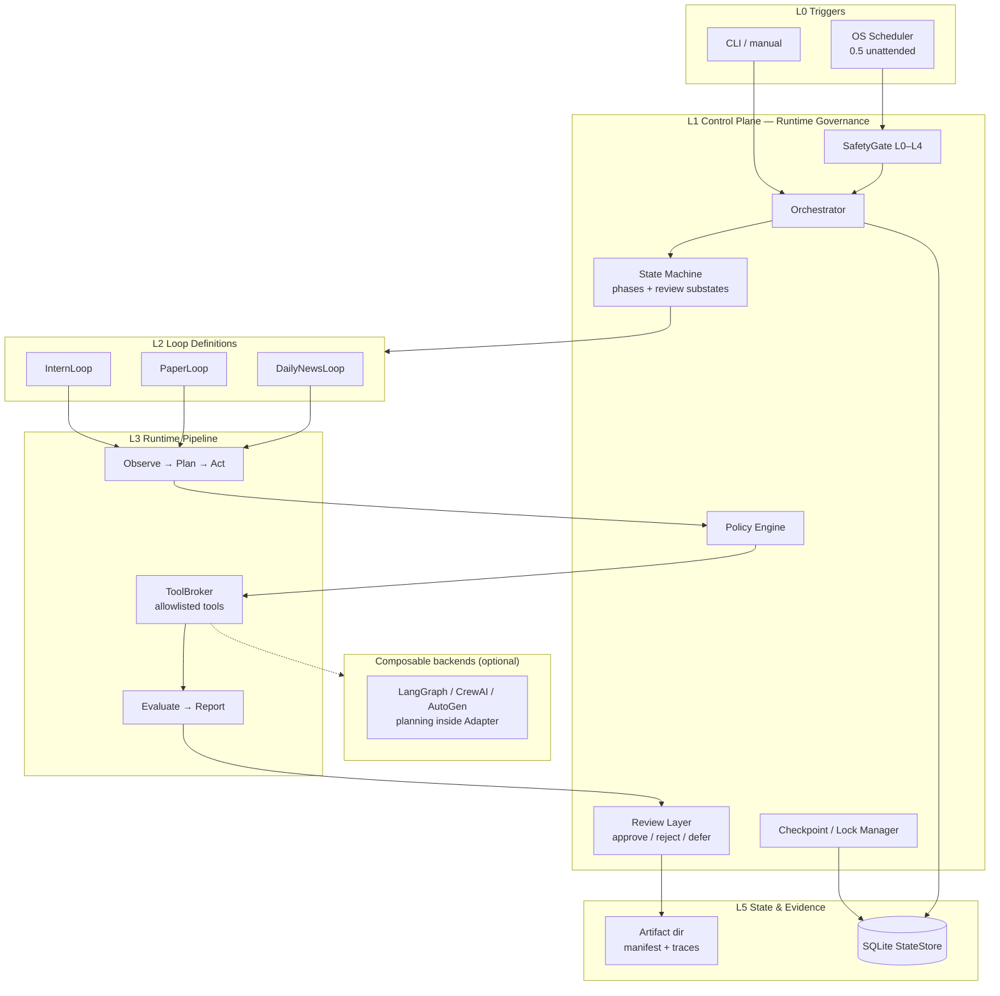

# Figure 1: LoopPilot Architecture

## Caption

**Figure 1.** LoopPilot architecture. TikZ source: `latex/main.tex` (Figure~\ref{fig:architecture}). Mermaid below is a supplementary sketch.

## Text for paper body

LoopPilot separates **orchestration** (inside loop implementations and adapters) from **governance** (control plane). Triggers may be manual CLI or, in 0.5, OS-scheduled unattended invocations that must pass SafetyGate before Orchestrator starts. Every mutating path flows through Policy Engine and ToolBroker; terminal paths produce sealed artifacts and may enter the review queue rather than claiming success.
