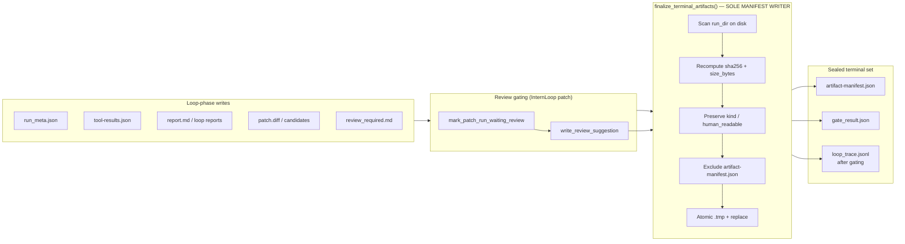

# Figure 3: Artifact Finalization Pipeline



## Manifest invariants M1–M5

See `tables/artifact-contract.md` for full table.

## Report path priority

```text
report.md
  → development-report.md (InternLoop)
  → paper-development-report.md (PaperLoop)
  → daily-news-report.md (DailyNewsLoop)
  → manifest fallback: kind == "report" only (never diff-summary.md)
```

## Caption

**Figure 3.** Artifact finalization pipeline. TikZ source: `latex/main.tex` (Figure~\ref{fig:artifact-pipeline}). Mermaid below is a supplementary sketch.

## Reviewer defense

Checksums are not trust-on-write—they are **verify-on-seal**. Recomputing from disk catches late writes and ordering bugs that inline manifest updates miss (failure F2).
