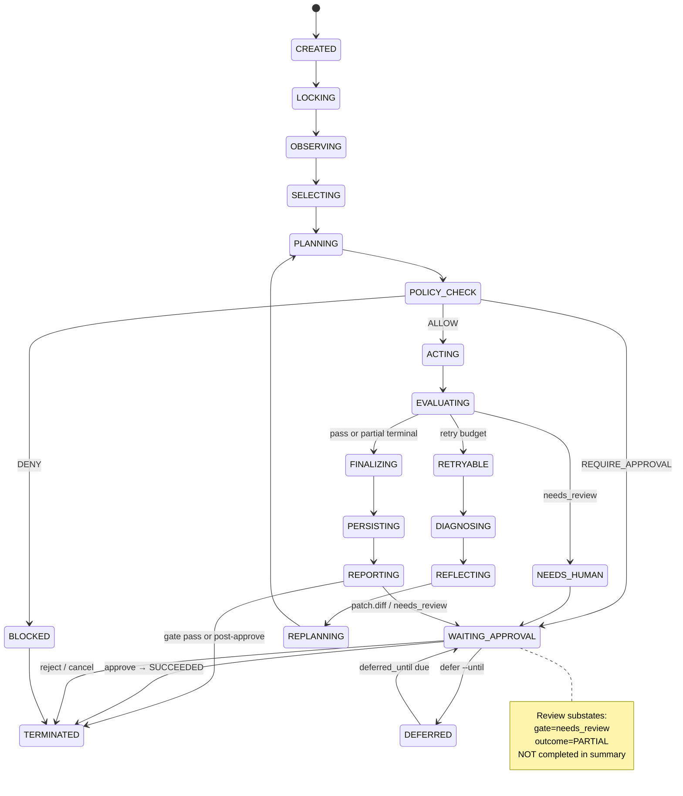

# Figure 2: Runtime State Machine and Review Substates

## Runtime invariants I1–I5

| ID | Invariant | Violation example (PR #8) |
|----|-----------|---------------------------|
| **I1** | `phase` and `outcome` are independent; terminal success requires consistent pair | `TERMINATED` + `SUCCEEDED` while `gate=needs_review` (P0/P2-1) |
| **I2** | `gate_result.json` is authoritative for review queue membership | Summary ignores gate, lists patch run as Completed |
| **I3** | No loop may write final `artifact-manifest.json` | InternLoop legacy manifest write (P1-3) |
| **I4** | Review substates persist until human decision or defer expiry | `upsert_pending` resetting deferred → pending (P2) |
| **I5** | `loop_trace.jsonl` terminal event reflects post-gate outcome | Trace shows succeeded before review downgrade (P2-3) |

## Caption

**Figure 2.** LoopPilot runtime state machine with review substates. TikZ source: `latex/main.tex` (Figure~\ref{fig:state-machine}). Mermaid below is a supplementary sketch.

## Reviewer defense

Reviewers may ask: "Why not treat approval as just another planning step?" Because planning errors are recoverable by replanning; **false terminal success** destroys auditability—downstream summaries, sync jobs, and humans believe work is done. LoopPilot makes review a **hard state**, not a prompt suggestion.
